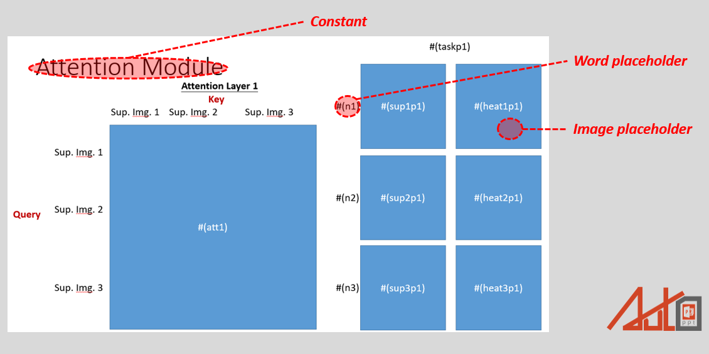
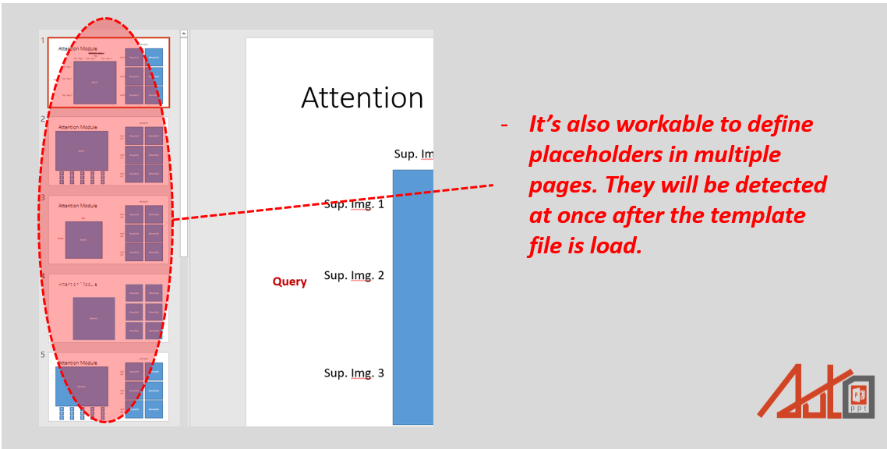

# AutoPPT toolbox
 

<br>It's again the day before reporting to your boss. Hundreds of thousands of tables and figures are smiling at you, evilly. You pray for rescue; just at that moment, suddenly, you reach this page. Congratulations! You've found AutoPPT, which is gonna be your sharpest Knife for experiment reports of all time; following the synopsis below, it'll lead you to a new world!! Try it now, let AutoPPT saves your hands from destruction by copying and pasting!!!</br>

# Synopsis
 
<br>AutoPPT is a simple module that helps display the data in some repeated and unified format. Users are only required to provide the design template, and then the repeated routine can be simply handled by python codes.</br>
## Requirement：</br>
`conda install -c conda-forge python-pptx` 

## Usage： </br>

### 1.Create the template silde. (Please take the example template "template.pptx" as reference.)
#### - How to set a placeholder: input #(variable name) in the block you want. The block will then transfer into a placeholder.
#### - Adding image placeholder: Create a rectangluar block by the shape tool, and then set #(variable name) on it.
#### - Adding word placeholder: Create a text box, and then set #(variable name) on it.
#### - Constant: "Constant" here represents all the other design which are not belong to placeholder. Constant will remain the same contant.
 
 </br>
 #### - Placeholders are allowed to distribute in any page of the powerpoint file.
 
 </br>


### 2. Import ppt_recorder from auto_ppt_module.py and load the template silde; after that, you can fill in the information to those pre-defined placeholders. For example:
```
from auto_ppt_module import ppt_recorder
import numpy as np
import io
from PIL import Image
import copy

# Create ppt recorder given the reference template.
writer = ppt_recorder(template='template_example.pptx')

# Get the placeholders that you've created in the template file. 
# Placeholders are formated in dictionary, in which the keys are repected to their name.
ph = writer.placeholder()

test_image1 = np.eye(128)
test_image2 = np.random.uniform(low=0.0, high=1.0, size=[64,64,3])

for i in range(3):
    
    # Duplicate a set of formate respected to your template pptx file.
    # You must include .new_record() in your code even if only one set of your template is needed in your report.
    writer.new_record()
    
    # Create a placeholder-data dictionary.
    feed_dict={ph['text1']:'Hello World!_'+str(i), 
             ph['pic1']:test_image1,
             ph['pic2']:test_image2,
             ph['text2']:"What's up, World?_"+str(i),
             ph['pic3']:test_image1,
             ph['pic4']:test_image2}

    # Assign your data to pptx file.
    writer.assign(feed_dict=feed_dict)

#export pptx file.
writer.to_pptx('result.pptx')
```
**Notice:**
<br>‧The input format for word placeholders should be **str**, otherwise, the program may not work correctly. If you would like to put a number here (e.g., float or integer), make sure to convert it into string before placing it into the placeholder.</br>
<br>‧The input format for image placeholders should be a 3D numpy array formatting in (W,H,C) and scaled in [0,1].</br>
