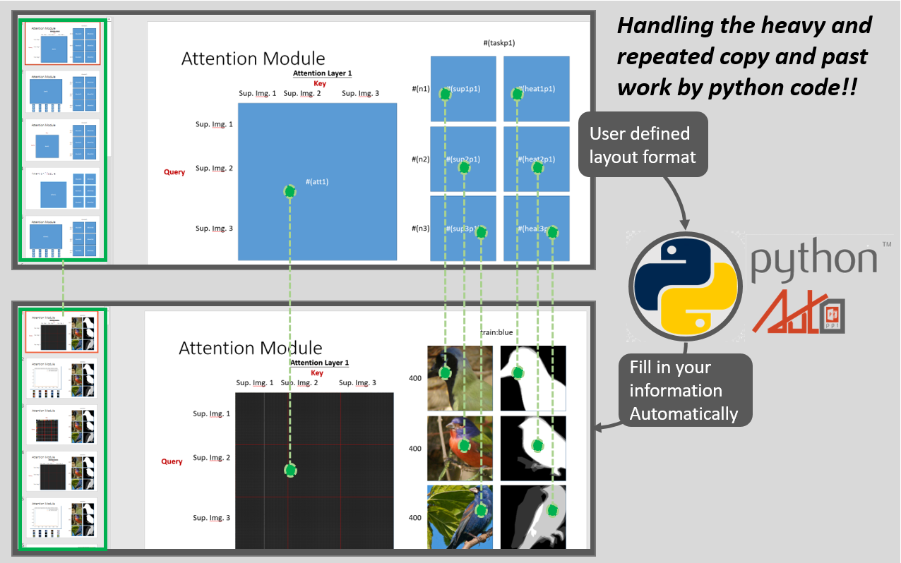

# AutoPPT
 

 It's again the day before reporting to your boss. Hundreds of thousands of tables and figures are smiling at you, evilly. You pray for rescue; just at that moment, suddenly, you reach this page. Congratulations! You've found AutoPPT, which ganna be your sharpest Knife for experiment reports of all time; following the synopsis below, it'll lead you to a new world. AutoPPT will save your hand from the destruction caused by copy and paste. 

# synopsis
 
 
-Requirement：

conda install -c conda-forge python-pptx

-Usage：

1.Create the template silde. (Please take the example template "template.pptx" as reference.)

‧如何設置變數(placeholder)：輸入 #(你的變數名稱) 於對應區塊。
‧新增圖片變數：使用圖形工具拉一個矩形，矩形中面設置變數名稱。
‧新增文字變數：使用文字工具拉一個文字方塊，方塊中設置變數名稱。

2. Import ppt_recorder from auto_ppt_module.py and load the template silde. (Reference: the main function in "auto_ppt_module.py")

‧文字輸入格式：str
‧圖片輸入格式：3D numpy array (W,H,C), which scaled in [0,1].
